# 🎵 SampleHeaven — Website Strategy & Planning Document

---

## 1. Website Goal

### Primary Goal
Build a **community-driven marketplace** where creators upload high-quality audio samples and sound assets, and where producers, musicians, and content creators can discover, preview, and download them — creating a self-sustaining ecosystem of shared sound.

### Secondary Goals
| Goal | Success Metric |
|---|---|
| Grow a library of user-contributed samples | 10,000+ samples within first 6 months |
| Build an active creator community | 1,000+ registered uploaders in year one |
| Drive organic traffic via SEO | 50,000+ monthly organic sessions within 12 months |
| Monetize through premium tiers & licensing | Launch freemium model by month 3 |
| Become a go-to resource for producers | Top 10 ranking for core sample-related keywords |

### Revenue Model Options
- **Freemium**: Free downloads with limits (e.g., 5/day); premium unlocks unlimited
- **Creator Subscriptions**: Uploaders pay for premium profiles, analytics, and featured placement
- **Licensing Tiers**: Royalty-free vs. commercial-use licensing at different price points
- **Affiliate / Sponsor**: Partner with DAW brands, plugin companies, and gear manufacturers

---

## 2. Target Audience

### Primary Personas

#### 🎧 Persona 1 — The Beat Maker (Downloader)
| Attribute | Detail |
|---|---|
| Age | 18–35 |
| Role | Hip-hop / electronic music producer |
| Tools | FL Studio, Ableton, Logic Pro |
| Pain Points | Hard to find quality free samples; tired of generic packs |
| Goals | Find unique loops, one-shots, and FX to speed up production |
| Behavior | Searches Google for "free 808 samples", browses by genre/BPM |

#### 🎹 Persona 2 — The Sound Designer (Uploader)
| Attribute | Detail |
|---|---|
| Age | 22–40 |
| Role | Sound designer, sample pack creator, audio engineer |
| Tools | Serum, Massive, field recording gear |
| Pain Points | No easy platform to share work and build reputation |
| Goals | Gain exposure, build a following, eventually sell premium packs |
| Behavior | Uploads curated packs, shares profile link on socials |

#### 🎬 Persona 3 — The Content Creator (Downloader)
| Attribute | Detail |
|---|---|
| Age | 20–45 |
| Role | YouTuber, podcaster, game developer, filmmaker |
| Tools | Premiere Pro, DaVinci Resolve, Unity, Unreal Engine |
| Pain Points | Needs royalty-free SFX and ambient sounds quickly |
| Goals | Find legally safe audio for content without licensing headaches |
| Behavior | Searches by category (e.g., "cinematic whoosh", "nature ambience") |

### Secondary Audiences
- **Music educators & students** looking for teaching/learning materials
- **App & game developers** needing UI sounds and game audio
- **Advertising / media agencies** sourcing production audio

---

## 3. Main Pages (Sitemap)

```mermaid
graph TD
    A["Homepage"] --> B["Browse / Explore"]
    A --> C["Upload"]
    A --> D["Pricing / Plans"]
    A --> E["About"]
    A --> F["Blog / Resources"]
    A --> G["Contact"]

    B --> B1["Search Results"]
    B --> B2["Category Page"]
    B --> B3["Sample Detail Page"]
    B --> B4["Sample Pack Page"]

    C --> C1["Upload Form"]
    C --> C2["Creator Dashboard"]

    H["Auth Pages"] --> H1["Sign Up"]
    H --> H2["Log In"]
    H --> H3["Forgot Password"]

    I["User Pages"] --> I1["User Profile (Public)"]
    I --> I2["My Library / Downloads"]
    I --> I3["Account Settings"]
    I --> I4["My Uploads"]

    J["Legal"] --> J1["Terms of Service"]
    J --> J2["Privacy Policy"]
    J --> J3["Licensing Terms"]
    J --> J4["DMCA / Copyright"]
```

### Page Descriptions

| Page | Purpose | Priority |
|---|---|---|
| **Homepage** | Hero + search + featured samples + categories + CTA | 🔴 Critical |
| **Browse / Explore** | Filterable grid of all samples; filter by type, genre, BPM, key, format | 🔴 Critical |
| **Search Results** | Dynamic results with inline audio preview | 🔴 Critical |
| **Sample Detail** | Waveform player, metadata, download button, related samples, creator info | 🔴 Critical |
| **Sample Pack Page** | Grouped samples in a pack with bulk download | 🟡 High |
| **Category Pages** | Genre/type landing pages (e.g., "Drum Loops", "Ambient Pads") | 🔴 Critical (SEO) |
| **Upload Form** | Drag-and-drop upload with metadata tagging | 🔴 Critical |
| **Creator Dashboard** | Upload management, analytics (plays, downloads), earnings | 🟡 High |
| **User Profile** | Public profile with bio, uploaded samples, follower count | 🟡 High |
| **My Library** | Saved/downloaded samples history | 🟢 Medium |
| **Pricing / Plans** | Free vs. Premium comparison table | 🟡 High |
| **Blog / Resources** | Tutorials, production tips, sample-making guides | 🟢 Medium (SEO) |
| **About** | Mission, team, story | 🟢 Medium |
| **Contact** | Support form, FAQ | 🟢 Medium |
| **Legal Pages** | ToS, Privacy, Licensing, DMCA | 🔴 Critical |

---

## 4. Homepage Sections (Top → Bottom)

### Section 1 — Hero Banner
- **Headline**: "Discover, Share, and Download Free Audio Samples"
- **Subheadline**: "Join thousands of producers sharing loops, one-shots, MIDI, and sound effects"
- **Primary CTA**: Search bar (prominently centered)
- **Secondary CTA**: "Start Uploading" button
- **Background**: Animated waveform or subtle audio-reactive visual
- **Trust Signals**: "50,000+ Samples · 10,000+ Creators · 100% Royalty-Free"

### Section 2 — Quick Category Navigation
- Visual icon grid or pill-based navigation
- Categories: Drum Loops · Melodic Loops · One-Shots · Bass · Vocals · SFX · MIDI · Ambient · Foley
- Each links to a dedicated category page

### Section 3 — Trending Samples
- Horizontal scrollable carousel
- Cards with: waveform thumbnail, play button, title, creator name, BPM/key, download count
- Inline audio preview on hover/click
- "View All Trending →" link

### Section 4 — Curated Packs / Staff Picks
- Featured sample packs hand-picked by editorial team
- Large cards with cover art, pack title, sample count, creator
- Rotated weekly

### Section 5 — Browse by Genre
- Grid of genre cards with background imagery
- Genres: Hip-Hop, Electronic, Lo-Fi, Cinematic, Pop, R&B, Trap, Ambient, Jazz, Rock
- Each links to filtered browse page

### Section 6 — How It Works
- Three-step visual flow:
  1. 🔍 **Search** — Find the perfect sample by genre, BPM, key, or instrument
  2. 🎧 **Preview** — Listen instantly with our in-browser waveform player
  3. ⬇️ **Download** — Grab royalty-free files ready for your DAW

### Section 7 — Featured Creators
- Spotlight cards for top uploaders
- Avatar, username, sample count, follower count
- "Follow" button and "View Profile" link

### Section 8 — Recent Uploads
- Chronological feed of the latest samples added
- Keeps the homepage fresh and signals an active community

### Section 9 — Community Stats / Social Proof
- Animated counters: Total Samples, Total Downloads, Active Creators, Countries
- Optional: testimonial quotes from creators

### Section 10 — Newsletter / CTA Banner
- "Get weekly sample drops in your inbox"
- Email signup form
- Incentive: "Subscribe and get a free sample pack"

### Section 11 — Footer
- Navigation links (Browse, Upload, Pricing, Blog, About, Contact)
- Legal links (Terms, Privacy, Licensing, DMCA)
- Social media icons
- Copyright notice

---

## 5. Content Needs

### User-Generated Content (UGC)
| Content Type | Format | Metadata Required |
|---|---|---|
| Audio Samples | WAV, MP3, FLAC, AIFF | Title, description, genre, BPM, key, instrument, tags |
| Loops | WAV, MP3 | BPM, key, bar length, genre |
| One-Shots | WAV, MP3 | Instrument type, note/pitch, genre |
| MIDI Files | .mid | Key, scale, instrument suggestion, genre |
| Sound Effects | WAV, MP3 | Category (foley, cinematic, UI, nature), description |
| Sample Packs | ZIP (containing above) | Pack title, description, track list, cover art |

### Editorial / Platform Content
| Content | Purpose | Frequency |
|---|---|---|
| Blog posts | SEO, education, community engagement | 2–4 per week |
| Production tutorials | Drive organic traffic, build authority | 1–2 per week |
| Creator spotlights | Community building, retention | 1 per week |
| Genre guides | SEO landing page content | Monthly |
| Sample-making guides | Attract uploaders | Bi-weekly |
| Licensing explainers | Reduce support tickets | Evergreen |
| Changelog / updates | Transparency | As needed |

### Visual Assets Needed
- Category icons (custom illustrated)
- Genre background images
- Default waveform/cover art placeholders
- Creator avatar placeholders
- Marketing banners for homepage rotations
- Email template designs
- Social media share cards (auto-generated per sample)

---

## 6. Forms & CTAs

### Forms

#### 📝 Sign-Up / Registration Form
| Field | Type | Required |
|---|---|---|
| Username | Text | ✅ |
| Email | Email | ✅ |
| Password | Password | ✅ |
| Account Type | Radio (Creator / Listener) | ✅ |
| Agree to Terms | Checkbox | ✅ |
| **Alternative**: OAuth | Google / GitHub / Discord | Optional |

#### 📤 Sample Upload Form
| Field | Type | Required |
|---|---|---|
| Audio File(s) | File upload (drag & drop) | ✅ |
| Title | Text | ✅ |
| Description | Textarea | Optional |
| Genre | Dropdown (multi-select) | ✅ |
| Type | Dropdown (Loop / One-Shot / SFX / MIDI) | ✅ |
| BPM | Number input | Conditional (loops) |
| Key / Scale | Dropdown | Conditional (melodic) |
| Instrument | Tag input | Optional |
| Tags | Tag input (max 10) | ✅ |
| License Type | Radio (Free / Premium / Custom) | ✅ |
| Cover Art | Image upload | Optional |
| Pack Grouping | Dropdown (existing pack or new) | Optional |

#### 🔍 Search / Filter Form
| Field | Type |
|---|---|
| Keyword search | Text input with autocomplete |
| Genre | Multi-select dropdown |
| Type | Checkbox group (Loop, One-Shot, SFX, MIDI) |
| BPM Range | Dual slider (60–200) |
| Key | Dropdown |
| Format | Checkbox (WAV, MP3, MIDI) |
| License | Toggle (Free / Premium / All) |
| Sort By | Dropdown (Newest, Most Downloaded, Trending, Rating) |

#### 📬 Newsletter Signup
| Field | Type | Required |
|---|---|---|
| Email | Email | ✅ |
| Preferred Genres | Checkbox group | Optional |

#### 📩 Contact / Support Form
| Field | Type | Required |
|---|---|---|
| Name | Text | ✅ |
| Email | Email | ✅ |
| Subject | Dropdown (General, Bug Report, DMCA, Licensing) | ✅ |
| Message | Textarea | ✅ |
| Attachment | File upload | Optional |

### CTAs (Calls to Action)

| Location | CTA Text | Action | Style |
|---|---|---|---|
| Hero Banner | "Search Samples" | Focus search input | Primary (large) |
| Hero Banner | "Start Uploading" | Navigate to upload | Secondary (outline) |
| Sample Card | ▶️ Play | Inline audio preview | Icon button |
| Sample Card | ⬇️ Download | Trigger download (auth-gated) | Icon button |
| Sample Detail | "Download Free" | Download file | Primary |
| Sample Detail | "Add to Library" | Save to user library | Secondary |
| Category Page | "Explore [Genre] Samples" | Filter browse page | Text link |
| Pricing Page | "Go Premium" | Checkout / upgrade | Primary (accent) |
| Pricing Page | "Start Free" | Sign up for free tier | Secondary |
| Blog Post | "Try These Samples →" | Link to related category | Inline CTA |
| Creator Profile | "Follow" | Follow creator | Small primary |
| Footer / Banner | "Subscribe for Weekly Drops" | Newsletter signup | Primary |
| Upload Page | "Publish Sample" | Submit upload form | Primary |
| Empty States | "Upload Your First Sample" | Navigate to upload | Primary |

---

## 7. SEO Keyword Strategy

### Head Keywords (High Volume, High Competition)
| Keyword | Monthly Volume (est.) | Intent | Target Page |
|---|---|---|---|
| free samples | 40,000+ | Navigational | Homepage |
| free drum samples | 12,000+ | Transactional | Category: Drums |
| free loops | 8,000+ | Transactional | Category: Loops |
| royalty free sounds | 6,000+ | Transactional | Homepage / Licensing |
| free sound effects | 15,000+ | Transactional | Category: SFX |
| free MIDI files | 5,000+ | Transactional | Category: MIDI |

### Long-Tail Keywords (Lower Volume, Higher Conversion)
| Keyword | Intent | Target Page |
|---|---|---|
| free 808 drum samples WAV | Transactional | Category: Drums > 808 |
| free lo-fi hip hop loops | Transactional | Category: Loops > Lo-Fi |
| free cinematic sound effects download | Transactional | Category: SFX > Cinematic |
| free vocal chops sample pack | Transactional | Category: Vocals |
| free trap hi-hat loops 140 BPM | Transactional | Search results / Category |
| royalty free ambient pads for film | Transactional | Category: Ambient |
| free MIDI chord progressions | Transactional | Category: MIDI |
| how to make your own samples | Informational | Blog |
| best free sample sites for producers | Informational | Blog / Homepage |
| where to upload samples online | Informational | About / Upload page |

### Content-Driven SEO Keywords (Blog / Resources)
| Topic Cluster | Target Keywords | Content Type |
|---|---|---|
| Sample making | "how to make drum samples", "sound design basics" | Tutorial |
| Production tips | "how to chop samples", "using loops in beats" | Guide |
| Genre guides | "best samples for lo-fi", "trap production samples" | Listicle |
| Tool reviews | "best free DAWs for sampling", "sample library management" | Review |
| Industry | "royalty free vs creative commons", "music licensing explained" | Explainer |

### Technical SEO Priorities
- **Schema Markup**: `MusicRecording`, `AudioObject`, `CreativeWork` for sample pages
- **Open Graph / Twitter Cards**: Auto-generated preview cards with waveform image and metadata
- **Canonical URLs**: Prevent duplicate content from filter/sort URL parameters
- **XML Sitemap**: Dynamic sitemap including all sample detail and category pages
- **Page Speed**: Lazy-load audio players, compress waveform images, use CDN for audio files
- **URL Structure**:
  - `/samples/{slug}` — individual sample
  - `/packs/{slug}` — sample pack
  - `/category/{genre}` — category landing
  - `/creator/{username}` — public profile
  - `/blog/{slug}` — blog post

### Internal Linking Strategy
- Every sample links to: its category, creator profile, and related samples
- Category pages link to: sub-categories, top samples, and relevant blog posts
- Blog posts link to: relevant categories and sample pages
- Creator profiles link to: all their uploads

---

## Next Steps

1. **Design the homepage** — Build out the full homepage with all sections listed above
2. **Create the component library** — Waveform player, sample cards, upload form, search/filter UI
3. **Build the full page set** — Browse, detail, upload, profile, pricing pages
4. **Implement SEO foundations** — Meta tags, schema markup, URL routing
